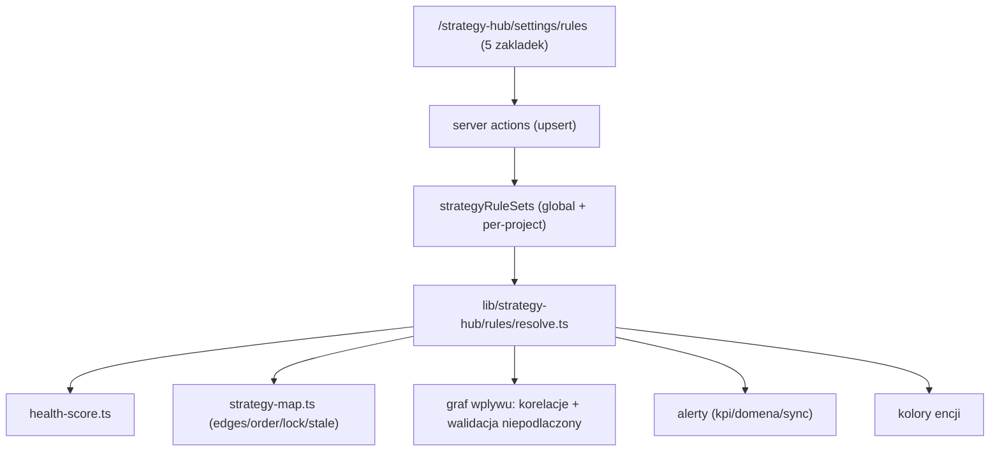

# 03 — Silnik reguł + menu ustawień

To serce prośby: **edytowalne reguły działania każdego modułu oraz połączeń i korelacji między nimi.** Dziś ta logika jest zahardkodowana w trzech miejscach:

- health-score (kryteria kompletności modułów) — [lib/strategy-hub/health-score.ts](lib/strategy-hub/health-score.ts)
- zależności makro mapy (krawędzie 7 węzłów + kolejność prezentacji) — [lib/strategy-hub/strategy-map.ts](lib/strategy-hub/strategy-map.ts) (linie 491–502)
- semantyka korelacji grafu wpływu + kolory encji — [lib/strategy-hub/strategy-map-types.ts](lib/strategy-hub/strategy-map-types.ts)

2.0 przenosi to do konfiguracji w DB (`strategyRuleSets`, patrz `02-model-danych.md`), edytowalnej w dedykowanym menu. Seed = obecne wartości → zero regresji.

## 1. Architektura



Rozwiązywanie konfiguracji: `resolve(projectId?)` = deep-merge `global` + (jeśli istnieje) override `scope = projectId`. Brak rekordu globalnego → wbudowany `DEFAULT_RULES` (ten sam co seed). Cache per request (`React.cache`/dedupe), bo czyta to health-score i builder mapy.

## 2. Kształt konfiguracji (`lib/strategy-hub/rules/types.ts`)

```ts
import { z } from "zod";

// ── Reguły modułu ──────────────────────────────────────────────
export const HealthCriterionSchema = z.object({
  id: z.string(),                  // np. "biz_problems"
  label: z.string(),               // "≥3 problemy z odpowiedzią"
  weight: z.number().min(0).max(1),
  // heurystyka liczenia: typ + parametry (interpretowane przez health-score)
  metric: z.enum(["count_gte", "field_filled", "ratio", "custom"]),
  entity: z.string().optional(),   // tabela/encja do policzenia
  target: z.number().optional(),   // próg dla count_gte
  field: z.string().optional(),    // pole dla field_filled
});

export const ModuleRuleSchema = z.object({
  key: z.string(),                 // "foundation" | "market" | ... | węzeł mapy
  label: z.string(),
  readyThreshold: z.number().default(80),     // ready gdy score ≥ X
  inProgressThreshold: z.number().default(1), // in_progress gdy score > X
  criteria: z.array(HealthCriterionSchema),
  lock: z.object({                 // downstream zablokowany gdy upstream pusty
    enabled: z.boolean().default(true),
    requiresUpstream: z.array(z.string()).default([]), // klucze węzłów upstream
  }),
  stale: z.object({                // pulsuje gdy upstream się zmienił
    enabled: z.boolean().default(true),
  }),
  visibleInClient: z.boolean().default(true),
});

// ── Połączenia (makro mapa) ────────────────────────────────────
export const ConnectionSchema = z.object({ from: z.string(), to: z.string() });

// ── Korelacje (graf wpływu) ────────────────────────────────────
export const CorrelationSchema = z.object({
  id: z.string(),
  sourceType: z.string(),          // InfluenceEntityType
  targetType: z.string(),
  label: z.string(),               // "wywołuje" | "zbija" | "adresuje" | ...
  defaultStrength: z.enum(["strong", "normal", "weak"]).default("normal"),
  required: z.boolean().default(false), // brak → czerwona ramka "niepodłączony"
});

// ── Alerty ─────────────────────────────────────────────────────
export const AlertsSchema = z.object({
  kpiBelowPct: z.number().default(80),
  kpiBelowDays: z.number().default(14),
  domainExpiringDays: z.number().default(30),
  syncFailThreshold: z.number().default(3),
});

// ── Wygląd ─────────────────────────────────────────────────────
export const PaletteSchema = z.record(z.string(), z.string()); // entityType -> hex

export const RulesConfigSchema = z.object({
  version: z.literal(1),
  modules: z.array(ModuleRuleSchema),
  connections: z.array(ConnectionSchema),
  presentationOrder: z.array(z.string()),
  correlations: z.array(CorrelationSchema),
  alerts: AlertsSchema,
  palette: PaletteSchema,
});

export type RulesConfig = z.infer<typeof RulesConfigSchema>;
```

## 3. Wartości domyślne = stan obecny (`lib/strategy-hub/rules/defaults.ts`)

`DEFAULT_RULES: RulesConfig` odwzorowuje 1:1 dzisiejszy hardcode:

- **connections** = krawędzie z [strategy-map.ts](lib/strategy-hub/strategy-map.ts):491–499:
  `fundament→segmenty, segmenty→lejek, lejek→kanaly, lejek→przekaz, segmenty→strona, lejek→strona, kanaly→kpi, strona→kpi`.
- **presentationOrder** = `["fundament","segmenty","lejek","kanaly","przekaz","strona","kpi"]`.
- **correlations** = semantyka z grafu wpływu (spec): `stage→element "wywołuje"`, `problem→element "adresuje"`, `objection→element "zbija"`, `goal→element "odpowiada na"`, `element→flow "realizowany przez"`, `element→seo "targetuje"`, `element→page "ląduje na"`, `element→channel "publikowany w"`, `element→campaign "promowany przez"`, `element→geo "cytowalny w AI przez"`, `element→kpi "mierzony przez"`. `required: true` dla `element→flow` i `element→kpi` (walidacja „niepodłączony").
- **modules** = kryteria health-score z [health-score.ts](lib/strategy-hub/health-score.ts) przepisane na `criteria[]`:
  - Marka: mission/vision/ToV filled + paleta wizualna.
  - Biznes: ≥3 problemy z odpowiedzią + UVP + statement pozycjonowania + ≥3 konkurenci + ≥5 obiekcji z dowodem.
  - Segmenty: ≥3 segmenty (karty z journey+KPI+quick wins+ryzyko+persona).
  - Lejek: każdy segment ≥1 etap/faza + ≥3 elementy/etap (heurystyka uproszczona jak dziś `chN`).
  - Kanały: ≥1 aktywność na top-segment × etap.
  - Sprzedaż: ≥1 pitch + ≥1 skrypt/segment + wytyczne copy.
  - KPI: ≥5 KPI z targetem + actualami w 30 dni.
  - Strona: % podstron z ≥3 sekcjami + CTA + flow.
  - lock/stale: `enabled: true`, `requiresUpstream` zgodne z connections (downstream wymaga upstream).
- **alerts** = `{ kpiBelowPct: 80, kpiBelowDays: 14, domainExpiringDays: 30, syncFailThreshold: 3 }` (ze spec sekcja Alerty).
- **palette** = obecne `ENTITY_COLORS` + `campaign`/`geo` z `02-model-danych.md`.

## 4. Resolver (`lib/strategy-hub/rules/resolve.ts`)

```ts
import "server-only";
import { cache } from "react";
import { db } from "@/db";
import { strategyRuleSets } from "@/db/schema";
import { eq, inArray } from "drizzle-orm";
import { DEFAULT_RULES } from "./defaults";
import { RulesConfigSchema, type RulesConfig } from "./types";

export const resolveRules = cache(async (projectId?: string): Promise<RulesConfig> => {
  const scopes = projectId ? ["global", projectId] : ["global"];
  const rows = await db.select().from(strategyRuleSets).where(inArray(strategyRuleSets.scope, scopes));
  const global = rows.find((r) => r.scope === "global")?.config;
  const override = projectId ? rows.find((r) => r.scope === projectId)?.config : undefined;
  const merged = deepMerge(DEFAULT_RULES, global ?? {}, override ?? {});
  return RulesConfigSchema.parse(merged); // walidacja — bezpieczny fallback
});
```

`deepMerge`: skalary i tablice nadpisywane przez wyższy scope; obiekty łączone głęboko. Override projektu nadpisuje globalny; brak override → globalny; brak globalnego → `DEFAULT_RULES`.

## 5. Refaktor konsumentów (czytają config zamiast stałych)

### health-score.ts
`computeProjectHealth(projectId)` przyjmuje `rules = await resolveRules(projectId)`; pętla po `rules.modules`, dla każdego liczy score z `criteria[]` (interpretacja `metric`), status z `readyThreshold`/`inProgressThreshold`. Zachować obecny kształt zwracany (`ProjectHealth`) — UI bez zmian. Bez regresji: domyślne kryteria == dzisiejsze heurystyki.

### strategy-map.ts
- `edges` (linie 491–499) → `rules.connections.map(({from,to}) => ({from,to}))`.
- `presentationOrder` (linie 502) → `rules.presentationOrder`.
- stany lock/stale węzłów liczone wg `rules.modules[].lock/stale`.

### graf wpływu
- etykiety i `required` krawędzi → `rules.correlations`.
- walidacja „niepodłączony" (czerwona ramka): element bez relacji oznaczonej `required` → `disconnected = true` (dziś sztywno „bez user flow lub KPI").
- kolory węzłów → `rules.palette` (fallback do `ENTITY_COLORS`).

### alerty
Moduł alertów (Faza 7) czyta `rules.alerts` zamiast magic numbers.

## 6. Menu ustawień — `/strategy-hub/settings/rules`

Strona w `app/(strategy-hub)/strategy-hub/settings/rules/page.tsx` (RSC ładuje `resolveRules()` global) + komponent kliencki `rules-editor.tsx`. Mutacje przez **server actions** (`app/(strategy-hub)/strategy-hub/settings/rules/actions.ts`) upsertujące `strategyRuleSets` po `scope` + `revalidatePath`. Auto-save inline z 300 ms debounce (filozofia UX), bez modali. Selektor zakresu u góry: **Globalne** vs **Per projekt** (override).

Reuse stylu istniejącego [settings-dashboard.tsx](app/(strategy-hub)/strategy-hub/settings/settings-dashboard.tsx) (sekcje, karty). Dodać pozycję „Reguły strategii" w istniejącym dashboardzie ustawień.

Zakładki (shadcn `Tabs`):

### a) Moduły
Lista 7 modułów/węzłów. Per moduł (accordion):
- progi `readyThreshold` / `inProgressThreshold` (Slider/Input).
- tabela kryteriów health-score: label, metric (Select), entity/field/target, weight (Slider). Dodaj/usuń kryterium.
- toggle lock + multiselect `requiresUpstream`.
- toggle stale.
- toggle `visibleInClient`.
- podgląd na żywo: „przy obecnych danych projektu X ten moduł ma score Y%".

### b) Połączenia
Edytowalny graf 7 węzłów (mini React Flow read/write lub macierz checkboxów `from × to`). Dodawanie/usuwanie krawędzi zależności; reorder `presentationOrder` (drag). Walidacja: brak cykli (DAG), brak krawędzi do samego siebie. Zmiana od razu odbija się na układzie makro mapy i propagacji lock.

### c) Korelacje
Tabela relacji typów encji: sourceType (Select z `InfluenceEntityType`), targetType, label (semantyka), defaultStrength, required (Switch). Dodaj/usuń. To steruje etykietami strzałek grafu wpływu i walidacją „niepodłączony".

### d) Alerty
Pola liczbowe: `kpiBelowPct`, `kpiBelowDays`, `domainExpiringDays`, `syncFailThreshold`. Krótkie opisy konsekwencji.

### e) Wygląd
Edytor palety: lista typów encji + color picker (OKLCH/hex). Limit ~8–10 — ostrzeżenie przy przekroczeniu („więcej = chaos"). Podgląd legendy grafu.

## 7. Bezpieczeństwo i walidacja

- Każdy zapis przechodzi `RulesConfigSchema.parse` (server action) — niepoprawny config odrzucony, UI pokazuje błąd.
- Reset do domyślnych: przycisk „Przywróć domyślne" usuwa override (lub nadpisuje global `DEFAULT_RULES`).
- Tylko rola z uprawnieniami edytuje reguły globalne (sprawdzić `users.role`); per-projekt edytuje właściciel projektu.

## 8. Kryteria akceptacji (Faza 0 + Faza 5)

- [ ] Seed wstawia `scope='global'` = `DEFAULT_RULES`; health-score i mapa dają **identyczne** wyniki jak przed refaktorem (regresja zerowa — zweryfikować na istniejących projektach).
- [ ] `resolveRules(projectId)` poprawnie merge'uje global+override.
- [ ] Edycja w 5 zakładkach zapisuje się i natychmiast wpływa na health-score/mapę/graf.
- [ ] `RulesConfigSchema` waliduje; błędny zapis odrzucony.
- [ ] `pnpm typecheck && pnpm lint && pnpm build` czysto.
