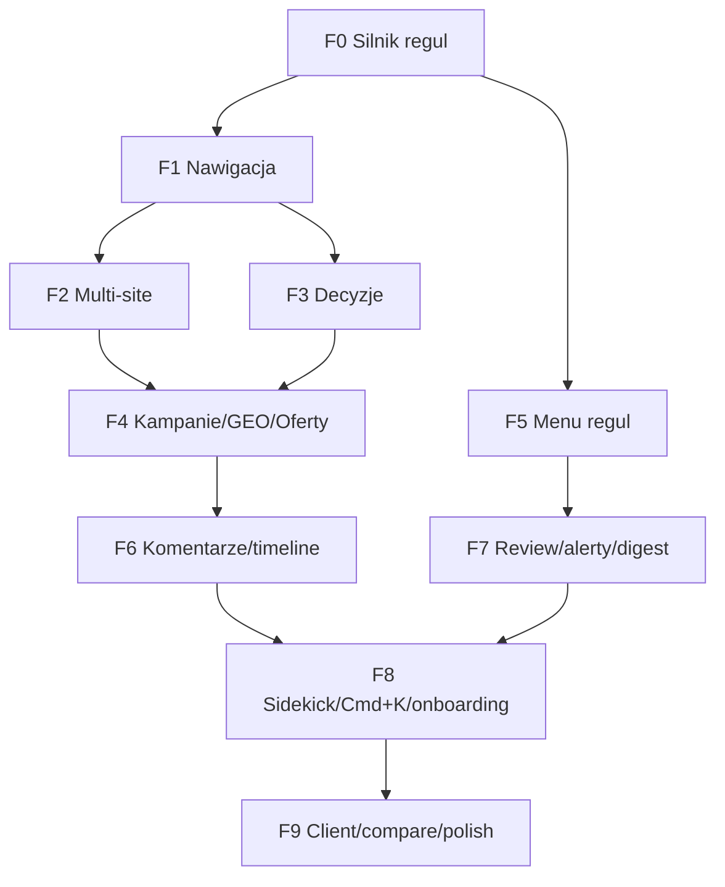

# 05 — Plan wdrożenia (fazy 0–9 dla Composera)

Realizuj fazy po kolei. Każda faza pozostawia aplikację w stanie działającym i kończy się **bramką jakości**:

```
pnpm typecheck && pnpm lint && pnpm build
```

(+ migracje DB, jeśli faza je wprowadza). Nie zaczynaj kolejnej fazy przed zielonym buildem. Każda nietrywialna decyzja → ADR w `docs/adr/NNN-tytul.md`. Zasada: TypeScript strict, brak `any`, RSC domyślnie, `"use client"` tylko gdy konieczny, a11y + `prefers-reduced-motion` na nowych interakcjach.

Legenda: [N] = plik nowy, [E] = edycja istniejącego, [M] = migracja DB.

---

## Faza 0 — Silnik reguł (fundament, bez zmian UI)

Cel: przenieść zahardkodowaną logikę do konfiguracji, zero zmian wizualnych, zero regresji health-score.

Kroki:
1. [M] `db/schema.ts` — dodać tabelę `strategyRuleSets` (`02-model-danych.md` §7). `pnpm drizzle:generate` → `db/migrations/0010_*`.
2. [N] `lib/strategy-hub/rules/types.ts` — schematy Zod + typy (`03-silnik-regul-i-ustawienia.md` §2).
3. [N] `lib/strategy-hub/rules/defaults.ts` — `DEFAULT_RULES` = 1:1 obecny hardcode (§3). Źródła: `strategy-map.ts:491–502`, `health-score.ts`, `strategy-map-types.ts`.
4. [N] `lib/strategy-hub/rules/resolve.ts` — `resolveRules(projectId?)` + `deepMerge` (§4), `cache`.
5. [E] `lib/strategy-hub/health-score.ts` — czytać `resolveRules` + liczyć z `criteria[]`. Zachować kształt `ProjectHealth`.
6. [E] `lib/strategy-hub/strategy-map.ts` — `edges`/`presentationOrder`/lock/stale z reguł.
7. [E] `prisma/seed.ts` (lub nowy `scripts/seed-rules.ts`) — upsert `scope='global'` = `DEFAULT_RULES` (idempotentnie).
8. ADR `docs/adr/0001-rules-engine-jsonb.md`.

Akceptacja:
- [ ] Na istniejących projektach (RetroHouse/Lumine) health-score i mapa **identyczne** jak przed fazą.
- [ ] `resolveRules()` zwraca `DEFAULT_RULES` bez rekordu w DB i merge'uje przy obecnym.
- [ ] Bramka jakości zielona.

---

## Faza 1 — Nawigacja (5 obszarów + ekran zerowy)

Cel: regrupować sidebar i trasy bez utraty żadnej funkcji; Custom Apps nietknięte.

Kroki:
1. [E] `components/strategy-hub/nav-sidebar.tsx` — zastąpić `viewItems`/`strategyItems` przez `projectViewItems` + `areaItems` (5 obszarów), health-score dot per obszar (`01-nawigacja-i-layout.md` §2). `customAppItems` bez zmian.
2. [N] layouty obszarów z tab-barem: `app/(strategy-hub)/strategy-hub/projects/[id]/{foundation,market,execution,measurement,project-settings}/layout.tsx` + `page.tsx` (default tab).
3. [E/N] przenieść istniejące ekrany pod nowe pod-route (zakładki):
   - brand → `foundation/brand`, business → `foundation/business`, segments → `market/segments`, funnel → `execution/funnel`, marketing → `execution/channels`, sales → `execution/copy`, website → `execution/sites`, kpi → `measurement/kpi`, discovery → `project-settings/discovery`, admin → `project-settings/access`.
   - Reuse istniejących komponentów-klientów (np. `business-strategy-editor`, `segments-editor`) — przenosimy montowanie, nie przepisujemy logiki.
4. [E] `/projects/[id]/page.tsx` — ekran zerowy = `<StrategyMap mode="editor" />` (scalić ze `strategy-map`).
5. [N] redirecty: cienkie `page.tsx` w starych ścieżkach → `redirect(...)` na nowe (`01` §3).
6. ADR `docs/adr/0002-nawigacja-5-obszarow.md`.

Akceptacja:
- [ ] Każda stara funkcja dostępna pod nowym route; stare URL-e przekierowują.
- [ ] Custom Apps (Liczenie godzin) działają bez zmian.
- [ ] Sidebar pokazuje 5 obszarów + Mapa firmy + Strategy Canvas + Custom Apps + System.
- [ ] Bramka jakości zielona.

---

## Faza 2 — Multi-site

Kroki:
1. [M] `sites` + `siteId` (nullable) w `pages`/`navItems`/`seoKeywords`/`siteAudits` (`02` §1). `drizzle:generate`.
2. [M/skrypt] migracja danych: per projekt 1 `sites` primary + przypisać `siteId` istniejącym rekordom (idempotentnie).
3. [E] `registry.ts` — `listDef` dla `sites`; dodać filtr `siteId` w listach pages/nav/seo/audits (parametr opcjonalny).
4. [N/E] `execution/sites` — przełącznik stron (`OptionCombobox`) + filtrowanie podwidoków (`04` §5). Reuse `website-dashboard`.
5. ADR `docs/adr/0003-multisite-siteid.md`.

Akceptacja: [ ] istniejące podstrony przypięte do primary site; przełącznik działa; bramka zielona.

---

## Faza 3 — Rejestr decyzji + overlay + ścieżka wstecz

Kroki:
1. [M] `strategicDecisions` + `decisionLinks` (`02` §2).
2. [E] `registry.ts` — `listDef` `decisions`; [N] endpoint relacji `decisionLinks` (wzór: funnel-elements/relations).
3. [N] `foundation/decisions` — tabela + edytor + oś czasu (`04` §1).
4. [E] Strategy Map — overlay „dlaczego tak?" + ścieżka wstecz (podświetlenie łańcucha z `decisionLinks`).
5. ADR jeśli decyzje projektowe nietrywialne.

Akceptacja: [ ] CRUD decyzji + powiązania cause/effect; overlay na mapie; bramka zielona.

---

## Faza 4 — Kampanie + GEO/AEO + Produkty

Kroki:
1. [M] `campaigns`+`funnelElementCampaigns`, `geoAssets`/`geoQueries`+`funnelElementGeo`, `offers`+`offerSegments` (`02` §3–5).
2. [E] `strategy-map-types.ts` — typy `campaign`/`geo` + kolory; [E] `strategy-map.ts` builder dołącza węzły z join.
3. [E] `registry.ts` — `listDef` `campaigns`/`geo-assets`/`geo-queries`/`offers`; [N] endpointy relacji N:N.
4. [N] `execution/campaigns`, `execution/geo`, `execution/offers` (`04` §2–4).
5. [E] graf wpływu — krawędzie „promowany przez"/„cytowalny w AI przez", walidacja `required` z reguł.

Akceptacja: [ ] nowe encje CRUD + widoczne w grafie wpływu; bramka zielona.

---

## Faza 5 — Menu ustawień reguł (5 zakładek)

Kroki:
1. [N] `app/(strategy-hub)/strategy-hub/settings/rules/page.tsx` (RSC ładuje `resolveRules`).
2. [N] `.../settings/rules/rules-editor.tsx` — 5 zakładek (Moduły/Połączenia/Korelacje/Alerty/Wygląd) (`03` §6). Selektor zakresu global/projekt.
3. [N] `.../settings/rules/actions.ts` — server actions upsert `strategyRuleSets` + `RulesConfigSchema.parse` + `revalidatePath`.
4. [E] `settings-dashboard.tsx` — link „Reguły strategii".
5. ADR jeśli potrzebny.

Akceptacja: [ ] edycja w 5 zakładkach zapisuje i natychmiast wpływa na health-score/mapę/graf; reset do domyślnych; walidacja; bramka zielona.

---

## Faza 6 — Komentarze + badges + version timeline

Kroki:
1. [M] `entityComments` (`02` §6).
2. [E] `registry.ts` — `listDef` `comments` (filtr entityType+entityId).
3. [N] `components/strategy-hub/entity-comments.tsx` — wątek per encja (drawer/panel).
4. [N] `components/strategy-hub/last-update-badge.tsx` + `version-timeline.tsx` (z `changeHistory`, diff + restore).

Akceptacja: [ ] komentarze na ≥3 typach encji; badge i timeline działają; bramka zielona.

---

## Faza 7 — Weekly review + alerty + email digest

Kroki:
1. [N] `measurement/review` — co zmieniono w 7 dni + KPI red list (z `rules.alerts`) + to-do + eksport PDF (`04` §7).
2. [N] `lib/strategy-hub/alerts.ts` — serwis czytający `rules.alerts` (KPI/domena/sync/wizyta). Toast + e-mail.
3. [N] `lib/strategy-hub/digest.ts` — tygodniowy digest Resend (top 3 zmiany, KPI 30 dni, linki, CTA).
4. [N] cron/route do digestu (Vercel cron lub `app/api/...`).

Akceptacja: [ ] review screen + PDF; alerty wg progów z reguł; digest wysyłany; bramka zielona.

---

## Faza 8 — AI Sidekick + Command Palette + onboarding

Kroki:
1. [N] `components/strategy-hub/ai-sidekick.tsx` (drawer Cmd+J, 3 zakładki) — reuse `chat-panel` + AI SDK (`04` §8). Slot w shellu.
2. [N] `components/strategy-hub/command-palette.tsx` (Cmd+K, `cmdk`) (`01` §5).
3. [N] `components/strategy-hub/use-hotkeys.ts` — skróty (`01` §6).
4. [E] `lib/strategy-hub/ai-tools.ts` + MCP — toole dla nowych encji (decyzje/kampanie/GEO/oferty).
5. [E] onboarding wizard 7 kroków (`04` §9) + empty states + „Zaimportuj z Notion".

Akceptacja: [ ] Cmd+K i Cmd+J działają globalnie; AI akcje kontekstowe; wizard tworzy szablon ~40%; bramka zielona.

---

## Faza 9 — Tryb client (dashboard) + compare + polish

Kroki:
1. [E] wszystkie widoki strategiczne — wsparcie `mode="client"` (read-only + komentarze, ukryte Discovery/Hosting/Audyt/Sync) (`01` §7).
2. [N/E] dashboard klienta na `syntance.dev` — reuse komponentów z `mode="client"`, token/login per projekt, tracking wizyt (`clientVisitsLog`).
3. [N] side-by-side compare (Cmd+Shift+C, `Resizable`) (`01` §8).
4. Polish: a11y audit (focus-visible/aria), `prefers-reduced-motion` na mapie/mikrointerakcjach, CWV (LCP<2.0s, CLS<0.05, INP<200ms), responsywność (`01` §10), eksport quadrantu PNG/SVG, confetti KPI>100%.

Akceptacja: [ ] dashboard klienta read-only spójny z Hubem; compare działa; audyt a11y/perf przechodzi; bramka zielona.

---

## Kolejność i zależności (skrót)



## Globalna checklista zakończenia projektu

- [ ] Wszystkie 5 obszarów + Mapa firmy + Custom Apps w sidebarze; stare URL-e przekierowują.
- [ ] Nowe moduły (decyzje, kampanie, GEO, oferty, multi-site, komentarze) z pełnym CRUD i obecne w grafie wpływu.
- [ ] Silnik reguł edytowalny w 5 zakładkach; health-score/mapa/graf czytają konfigurację; seed = stan obecny.
- [ ] Tryb client + dashboard klienta read-only.
- [ ] AI Sidekick + Command Palette + skróty + onboarding.
- [ ] `pnpm typecheck && pnpm lint && pnpm build` zielone; brak `any`; a11y + CWV spełnione.
- [ ] ADR-y dla silnika reguł, multi-site, nawigacji.
