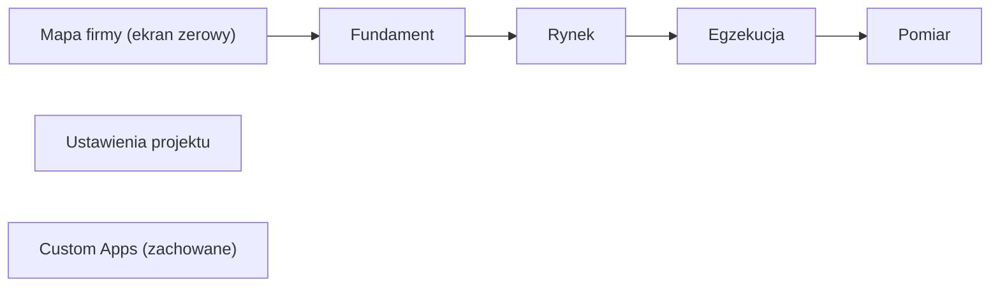
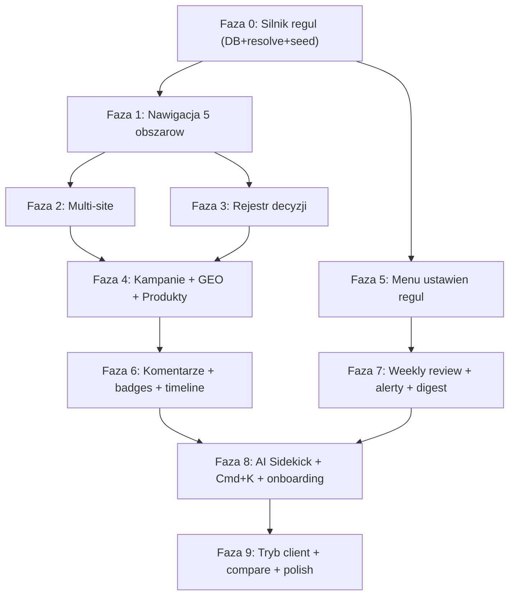

# Strategy Hub 2.0 — plan redesignu

> Źródło prawdy dla Composera. Realizuj fazy po kolei z `05-plan-wdrozenia.md`.
> Specyfikacja produktowa: Notion „Strategy Hub — Strategia (biznes + marketing + UX)".
> Podejście: **inkrementalna migracja** — reuse istniejącej bazy, dokładanie modułów i regrupowanie nawigacji fazami. Bez big-bang rebuildu.

## 1. Cel

Przeprojektować aplikację `syntance.dev/strategy-hub` do wersji 2.0 zgodnie ze specyfikacją, przy zachowaniu:

- układu interfejsu: **lewy sidebar z grupami pozycji** + nagłówek + workspace,
- sekcji **Custom Apps** (Liczenie godzin) — bez zmian funkcjonalnych,
- dojrzałej warstwy danych: rejestr encji, dynamiczne route'y, edytory, Strategy Map, ścieżki strategii.

Najważniejsze cele jakościowe (z reguł `00-core` i `50-perf-a11y`): TypeScript strict bez `any`, RSC domyślnie, `"use client"` tylko gdy potrzebny stan/efekt/DOM, WCAG 2.2 AA, `prefers-reduced-motion`, LCP < 2.0s, CLS < 0.05, INP < 200ms.

## 2. Trzy filary tej wersji

1. **Nawigacja spłaszczona do 5 obszarów + Mapa firmy jako ekran zerowy.** Maks. 2 kliknięcia od mapy do edytora encji. Stare strony stają się zakładkami wewnątrz obszaru.
2. **Nowe moduły 2.0:** Rejestr decyzji, Kampanie i reklamy, GEO/AEO, Produkty i usługi, Multi-site (N stron WWW per projekt), komentarze per encja, weekly review, AI Sidekick, onboarding wizard.
3. **Konfigurowalny silnik reguł.** Logika health-score, zależności mapy i semantyka korelacji przestają być zahardkodowane — trafiają do tabeli konfiguracji edytowalnej w dedykowanym menu ustawień (reguły modułów / połączenia / korelacje / alerty / wygląd).

## 3. Stan zastany (audyt — punkt wyjścia)

Stack: Next.js 16 (App Router) + React 19, Drizzle ORM (Postgres), shadcn/ui (`@base-ui`/Radix), Tailwind v4, Framer Motion (`motion`), React Flow (`@xyflow/react`), AI SDK (`@ai-sdk/anthropic`), Tiptap, Resend.

### Co zostaje (reuse — NIE przepisywać od zera)

| Obszar | Plik / lokalizacja | Uwaga |
|---|---|---|
| Rejestr encji | [lib/strategy-hub/entities/registry.ts](lib/strategy-hub/entities/registry.ts) | wzorzec `listDef`/`singletonDef`; nowe encje dokładamy tu |
| Dynamiczny API dispatch | [app/api/strategy-hub/projects/[id]/[entity]/route.ts](app/api/strategy-hub/projects/[id]/[entity]/route.ts) | route'y dispatchują po kluczu encji |
| Shell + sidebar | [components/strategy-hub/strategy-hub-shell.tsx](components/strategy-hub/strategy-hub-shell.tsx), [components/strategy-hub/nav-sidebar.tsx](components/strategy-hub/nav-sidebar.tsx) | zachować layout, regrupować pozycje |
| Strategy Map (3 widoki) | [components/strategy-hub/strategy-map/](components/strategy-hub/strategy-map/), [lib/strategy-hub/strategy-map.ts](lib/strategy-hub/strategy-map.ts) | lista / mapa makro / graf wpływu już istnieją |
| Ścieżki strategii (tracks) | [lib/strategy-hub/strategy-map-types.ts](lib/strategy-hub/strategy-map-types.ts), tabela `strategyPaths` | = „Ścieżki strategii (2.0)" ze spec — JUŻ JEST |
| Graf wpływu (encje + relacje) | tabele `funnelElements`, `funnelElementChannels`, `funnelElementKpis`, `userFlowPages` | rozszerzamy o kampanie/GEO |
| Custom Apps | [app/(strategy-hub)/strategy-hub/apps/time-tracking/](app/(strategy-hub)/strategy-hub/apps/time-tracking/) | zachować bez zmian |
| Health-score | [lib/strategy-hub/health-score.ts](lib/strategy-hub/health-score.ts) | refaktor: czytać config zamiast stałych |
| Motywy | [components/strategy-hub/theme-provider.tsx](components/strategy-hub/theme-provider.tsx) | dark/light/earth/auto — zostaje |

### Co już istnieje a spec nazywa „nowym 2.0"

- **Ścieżki strategii (tracks)** = tabela `strategyPaths` + `PathSelector`. Gotowe, tylko podpiąć pod nowe encje.
- **Graf wpływu** = `<StrategyMap />` widok „influence". Gotowy szkielet; dokładamy typy `campaign`, `geo`.

### Czego brakuje (do zbudowania)

`sites` (multi-site), `strategicDecisions` + `decisionLinks`, `campaigns` + `funnelElementCampaigns`, `geoAssets`, `geoQueries` + `funnelElementGeo`, `offers` + `offerSegments`, `entityComments`, `strategyRuleSets` (silnik reguł). Szczegóły: `02-model-danych.md`.

## 4. Mapowanie nawigacji (skrót)

| Obszar 2.0 | Trasa | Zawiera (zakładki) |
|---|---|---|
| Mapa firmy | `/projects/[id]` | StrategyMap editor (ekran zerowy) |
| Fundament | `/projects/[id]/foundation` | Marka, Problemy/ambicje, UVP, Pozycjonowanie+Konkurencja, Obiekcje, Rejestr decyzji |
| Rynek | `/projects/[id]/market` | Segmenty, Persony/JTBD, Buyer journey, Dane rynkowe+kryteria |
| Egzekucja | `/projects/[id]/execution` | Lejek, Kanały+mapa działań, Kampanie, Przekaz/copy, SEO+GEO, Strony WWW, Produkty |
| Pomiar | `/projects/[id]/measurement` | KPI, Audyty, Weekly review, Raporty |
| Ustawienia projektu | `/projects/[id]/project-settings` | Discovery, Dostępy/hosting, Sync z Notion |
| Custom Apps | `/apps/*` | Liczenie godzin (bez zmian) |

Pełne mapowanie ze starych tras: `01-nawigacja-i-layout.md`.

## 5. Mapa faz i zależności

Faza 0 jest fundamentem (silnik reguł). Faza 1 (nawigacja) odblokowuje wszystkie obszary. Każda kolejna faza jest niezależnie wdrażalna i pozostawia aplikację w stanie działającym.

## 6. Pliki tego planu

| Plik | Zakres |
|---|---|
| `README.md` (ten) | przegląd, audyt, decyzje, mapa faz |
| `01-nawigacja-i-layout.md` | sidebar, trasy, ekran zerowy, Cmd+K, skróty, tryby editor/client |
| `02-model-danych.md` | nowe tabele, migracja 0010, zmiany registry |
| `03-silnik-regul-i-ustawienia.md` | `strategyRuleSets`, resolve, refaktor, UI 5 zakładek |
| `04-moduly-2.0.md` | spec UI/UX nowych modułów |
| `05-plan-wdrozenia.md` | fazy 0–9 krok po kroku z kryteriami akceptacji |

## 7. Decyzje architektoniczne (ADR)

Każda nietrywialna decyzja → ADR w `docs/adr/NNN-tytul.md`. Minimalny zestaw dla 2.0:

- `ADR: silnik reguł jako konfiguracja JSONB zamiast hardcode` (Faza 0).
- `ADR: multi-site przez nullable siteId z domyślnym primary site` (Faza 2, bezpieczna migracja istniejących danych).
- `ADR: spłaszczenie nawigacji do 5 obszarów + redirecty starych tras` (Faza 1).

## 8. Definicja gotowości (per faza)

- [ ] `pnpm typecheck` bez błędów (TS strict, brak `any`).
- [ ] `pnpm lint` czysto.
- [ ] `pnpm build` przechodzi.
- [ ] Migracje DB aplikowalne i odwracalne (każda nowa kolumna nullable lub z defaultem).
- [ ] Brak regresji health-score (seed reguł = obecne wartości).
- [ ] A11y: focus-visible/aria na nowych interaktywnych; `prefers-reduced-motion` wyłącza animacje mapy.
- [ ] Custom Apps działają identycznie jak przed fazą.
